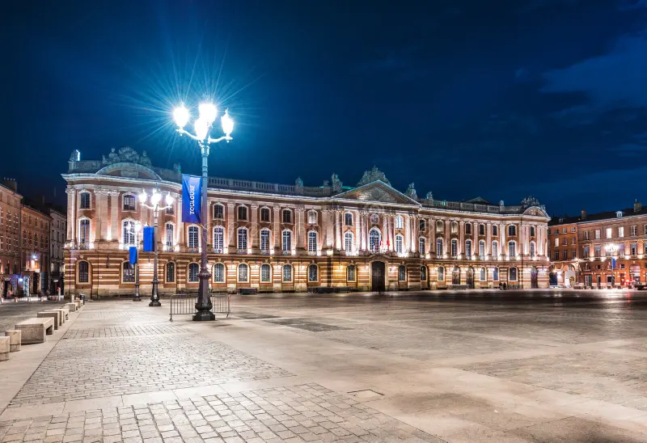
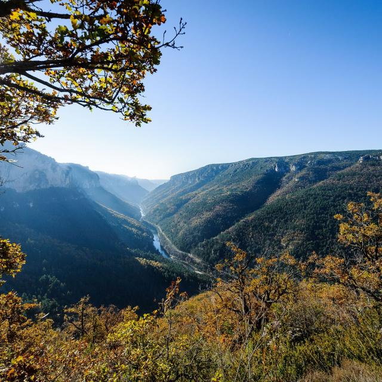

## L'Occitanie

Fusion du Languedoc-Roussillon et des Midi-Pyrénées en 2014, l'Occitanie est le mariage du Sud-Ouest avec la Méditérranée.
Fort de ses six millions d'habitants et de sa très superficie, l'Occitanie s'impose comme une grande région majeure du sud de la France. Sa capitale est la ville rose, Toulouse

en Occitanie il y a beaucoup d'espaces sauvages et de parc naturels, comme par exemple celui des Cévennes

Pour rappel, vous pouvez à nouveau ⬇️

[Visiter Jacou](./ma-ville.md)

[Visiter l'Hérault](./mon-departement.md)

[Retour à l'index](./index.md)

---

Fait avec ❤️ par SpaceInvaderEO👽