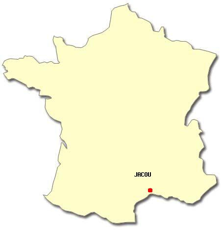

## Jacou

*Jacou* est un village somme toute assez classique d'un peu moins de 7000 habitants qui se situe ici

Charmant et agréable à vivre, le village est proche de toutes les commodités :

- La plage
- La montagne
- Montpellier (via le tram)

Il est maintenant temps de présenter les alentours ⬇️

[Retour à l'index](./index.md)

[Visiter l'Hérault](./mon-departement.md)

[Visiter L'Occitanie](./ma-region.md)

---

Fait avec ❤️ par SpaceInvaderEO👽