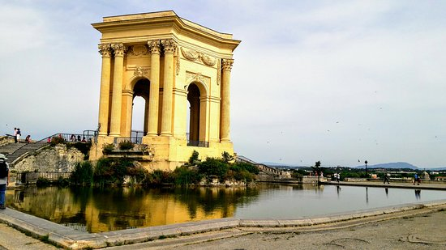
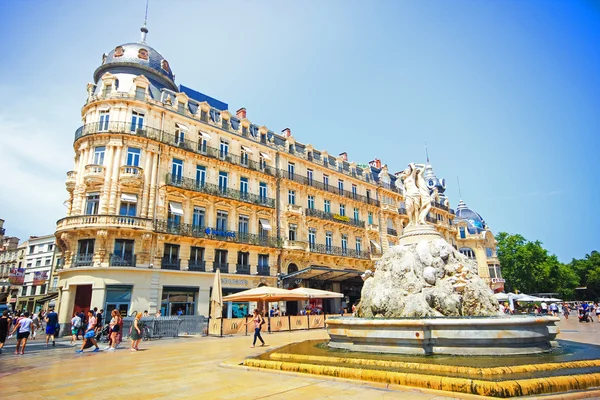
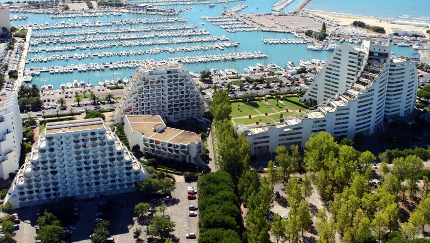
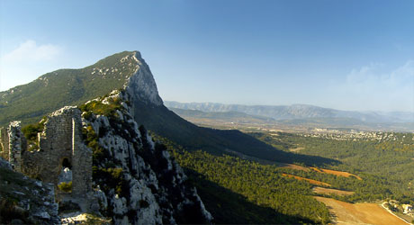
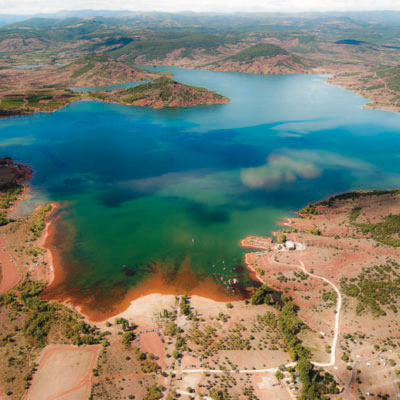

## Hérault, entre la camargue, la méditérranée et la Lozère

<ins>L'Hérault</ins> est situé dans le sud de la **France**., et compte un peu plus d'un million deux cent mille habitants

Flanqué du *Gard*, de l'*Aveyron*, du *Tarn* et de la *Lozère* à ses frontières, il jouit également d'un grand littoral, bordé par la mer *Méditérranée*

Voici le blason de l'Hérault, mélange des armoiries des Comtes de Montpellier et de Toulouse

On ne peut pas parler de l'Hérault sans parler de sa capitale, <ins>Montpellier</ins>, célèbre ville étudiante d'environ trois cent mille habitants (presque cinq cent mille si parle de l'agglomération)

Voici quelques lieu incontournables de Montpellier :

-> Le Peyrou

-> La Comédie

L'Hérault c'est aussi ses plages, ses vallées et son arrière-pays, quelques lieux symboliques en vrac :

-> La Grande-Motte

-> Le Pic Saint-Loup

-> Le lac du Salagou

Pour la suite de la visite ⬇️

[Retour à l'index](./index.md)

[Visiter Jacou](./ma-ville.md)

[Visiter L'Occitanie](./ma-region.md)

---

Fait avec ❤️ par SpaceInvaderEO👽